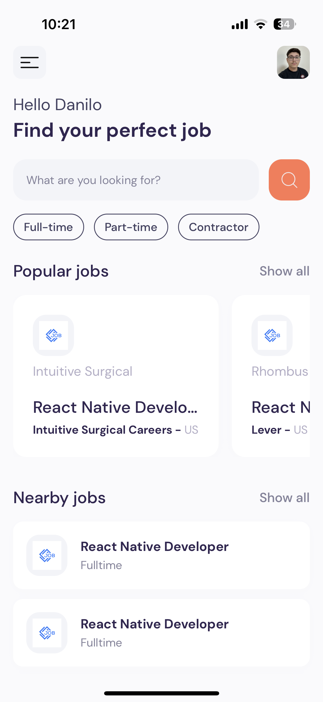
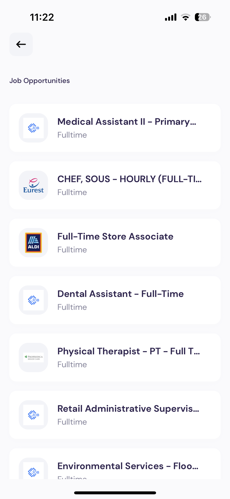
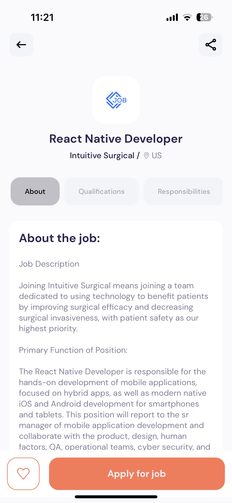

# Job Searching App 💼

Welcome to the Job Searching App built with React Native! This app is designed to help you search for job listings conveniently right from your mobile device. Whether you're actively looking for a new job or just curious about opportunities, this app has got you covered.

## Screenshots

Here are some screenshots of the app in action:

1. Home Screen


2. Job Listings


3. Job Details


## Features

- Search and browse through a wide range of job listings.
- View detailed information about each job.
- Apply filters to narrow down search results.
- User-friendly interface for seamless navigation.

## Installation and Running

To run the app locally on your machine, follow these steps:

1. **Clone Repository**: Start by cloning this repository to your local machine using the following command:

   ```
   git clone <repository-url>
   ```

2. **Navigate to Project Folder**: Move into the project directory:

   ```
   cd job-searching-app
   ```

3. **Install Dependencies**: Install the required dependencies using npm or yarn:

   ```
   npm install
   ```

   or

   ```
   yarn install
   ```

4. **Start Expo Metro Bundler**: Run the following command to start the Expo Metro Bundler:

   ```
   npm start
   ```

   This will open a new tab in your browser displaying a QR code.

5. **Run the App**: Install the Expo Go app on your mobile device. Use it to scan the QR code displayed in the browser. This will load the app on your device.

   Alternatively, you can run the app on an emulator by pressing the appropriate keys displayed in the terminal.
